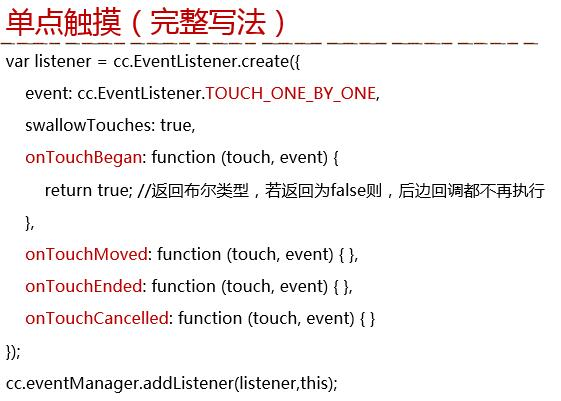

# H5动画与游戏开发不负责任指北

# 一 Canvas

**canvas简介**

Canvas是H5出现的新标签，用于在Web端完成图形的绘制和动画的实现，它是图形动画的容器，与其他DOM元素节点类似(拥有对应的属性、方法和事件)
Canvas 提供了相应的API，通过JS脚本来完成相应的图形、图像及动画操作(用程序来绘画、图像处理和生成动画)
Canvas是基于状态绘图，采用即时模式(immediate mode)进行位图的绘制和操作

**svg简介**

SVG 是基于可扩展标记语言XML，用于描述二维矢量图形的一种图形格式。
SVG 基于 XML，这意味着 SVG DOM 中的每个元素都是可用的 ，可以为每个元素附加 JavaScript 事件处理器。
在 SVG 中，每个被绘制的图形均被视为一个对象(SVG保留模式区别于Canvas的即时模式)，如果 SVG 对象的属性发生变化，那么浏览器能够自动重现图形

通常，随着屏幕尺寸的增加，Canvas效率开始降低，因为需要绘制更多的像素。随着屏幕上对象数量的增加，SVG效率开始降低，因为我们不断将它们添加到DOM

**WebGL简介**

WebGL是一种3D绘图标准，这种绘图技术标准允许把JavaScript和OpenGL ES结合在一起。Web开发人员就可以借助系统显卡来在浏览器里更流畅地展示3D场景和模型了，还能创建复杂的导航和数据视觉化。WebGL完美地解决了现有的Web交互式三维动画的两个问题：第一，它通过HTML脚本本身实现Web交互式三维动画的制作，无需任何浏览器插件支持；第二，它利用底层的图形硬件加速功能进行的图形渲染，是通过统一的、标准的、跨平台的OpenGL接口实现的

D3.js是常见的SVG引擎，Three.js是常见WebGL引擎

**Canvas基础**

详见canvas1/index.html

**Canvas图像操作**

详见canvas2/index.html

**Canvas动画**

详见canvas3/index.html

# Cocos

**工程结构及核心概念**

工程结构概述：  

* frameworks:引擎框架
* res:资源路径
* src:源代码
* index.html main.js:程序入口
* project.json:配置文件
* 起始场景案例:src/app.js

创建一个非原生游戏工程: `cocos new –l js --no-native Demo_1`

*1.坐标系*

Cocos2d采用的是笛卡尔坐标系

笛卡尔坐标系:  

Cocos坐标系:  

*2.节点*

cc.Node类是所有可视化组件类的根类

Cocos2d-JS采用层级（树形）结构来管理场景、层、精灵、菜单等节点(Node)

节点常用的方法和属性：

常用方法：addChild、getChildByTag、removeChild、setZOrder、setScale、setPosition、setVisiable、pause、onEnter、onExit、schedule、update …  
常用属性：_visible、tag、_parent、_scheduler、_running、_localZOrder …

*3.锚点*

锚点就是给节点定位和仿射变换的基准点  
锚点的取值范围[0，1],层的默认锚点为(0，0)，其他节点为(0.5，0.5),可设置锚点忽略

Cocos中的锚点:  

*4.世界坐标系与本地坐标系*

注意锚点  

了解世界坐标系和本地坐标系(世界坐标系就是根坐标系，最开始的那个坐标系，而本地坐标系是相基于某一点为起始点而生成的一个相对坐标系):  

世界坐标系和基本坐标系的转换:  
  

*5.Z轴*

Cocos中是由Z轴的，即有堆叠顺序，addChild方法中第二个参数为一个数值即指定Z轴方向上的位置

*6.定时器()*

基于节点、都是节点上的方法

开启定时器

* scheduleUpdate()
	> 让游戏在每帧执行都执行update方法
* schedule(callback,interval,repeat,delay)
	> 和setInterval类似，实现固定时间间隔不断触发某个函数的功能。interval是触发间隔(以秒为单位)，repeat是重复次数(会执行repeat+1次)delay是第一次出发前的延迟时间(以秒为单位)如果希望schedule无限循环，可以省略后两个参数
* scheduleOnce()
	> 和setTimeout类似，接受两个参数，第一个参数是回调函数，第二个参数是时间(以秒为单位)

停止定时器

* unscheduleUpdate()
* unschedule(callback)
* unscheduleAllCallback()

暂停与恢复定时器

* node.pause()  //暂停
* node.resume() //恢复

**标签**

*标签种类*

TTF标签、Atlas标签、BMFont标签

*1.cc.LabelTTF(字体标签)*  

TTF(TrueType Font)是一种字库规范，字体文件格式  
特点：简单、效率比较低、字体资源太大  
如：cocos2/Demo_02/src/app.js

*2.cc.LabelAtlas（图片集标签）*

从图片中找出对应字的位置和尺寸，裁切取得字符
以连续的scall码识别，常用于显示数字或英文字符

特点：效率比TTF标签高

*3.cc.LabelBMFont（位图标签）*

**菜单(Menu)和菜单项(MenuItem)**

* 字体标签菜单(cc.MenuItemFont) 参数 "文字" 回调 this
* 精灵和图片菜单(cc.MenuItemImage) 参数四个必填:开始图片 被选中图片 回调 this
* 开关菜单(cc.MenuItemToggle) (首先创建两个菜单项)参数四个 开始时菜单项 结束时菜单项 回调 this

cocos2/Demo_03/src/app.js

**场景(cc.Scene)**

游戏中的场景就像是电影中变换舞台和场地，我们可以通过导演(cc.Director)的一系列方法控制游戏中不同的场景的自由切换

场景通常是层的容器，包含了所有不同功能的游戏层。
通常，当我们需要完成一个场景时候，会创建一个Scene的子类，并在子类中实现我们需要的功能（初始化中载入游戏资源，为场景添加层，启动音乐播放等）

*过度场景*（cc.TransitionScene）是场景（cc.Scene）的子类，可以提升场景切换的效果

场景类图  

场景的生命周期：

* ctor( )构造函数
* onEnter( )进入场景时
* onEnterTransitionDidFinish( )进入且过度结束
* onExit( )退出场景时
* onExitTransitionDidFinish( )退出且过度结束

**层(cc.Layer)**

层是处理玩家事件响应的Node子类，层通常包含的是直接在屏幕上呈现的内容（精灵，文本标签或者其他游戏元素），并且可以接受用户的输入事件，包括触摸，加速度和键盘输入等，游戏内容相关的逻辑代码也编写在层中
对于场景而言，通常我们添加的节点就是层，可以通过zOrder来调整顺序

场景上的层：  

层的种类：

* 自定义层（var MyLayer ＝ cc.Layer.extend({});）
* 颜色层（cc.LayerColor）
* 层渐进层（cc.LayerGradient）
* 滑动视图（cc.ScrollView）
* 表视图（cc.TableView）
* 菜单（cc.Menu)

场景和层是一对多(可一对一)的关系

**导演**

导演采用的是单例模式

导演、场景、层三者之间的关系：  

环境设定:  
－设置显示游戏的视图，包含视图的投射，像素格式，等等  
－设置游戏运行帧率及一些全局状态。

执行主循环（由导演控制暂停、继续）:  
－暂停主循环：cc.director.pause()  
－恢复主循环：cc.director.resume()

场景管理:  
－cc.director.runScene()  让导演对象执行目标场景  
－cc.director.pushScene()  将一个新场景推入场景栈中，并替换运行场景为这个新场景  
－cc.director.popScene()  将场景栈顶的场景推出场景栈，并替换运行场景为推出后栈顶的新场景  
－cc.director.popToRootScene()  将场景栈中除了栈底的根场景以外的所有场景推出，并替换运行场景为根场景

**精灵(Sprite)**

游戏中的主角、飞机、子弹等等都是精灵。它可以移动，旋转，缩放，执行动画，播放帧动画，并接受其他转换，精灵一般要结合事件处理、碰撞检查等操作完成游戏逻辑

碰撞检测：  

碰撞检测形如：  

	// 点在矩形内
    if(cc.rectContainsPoint(sp1.getBoundingBox(),sp2.getPosition())){
    	cc.log("碰到了");
    }
    
	// 矩形在矩形内
	if(cc.rectContainsRect(sp1.getBoundingBox(),sp2.getBoundingBox())){
    	cc.log("碰到了");
    }

屏幕适配方案：  

* cc.ResolutionPolicy.EXACT_FIT       （可能有拉伸）
* cc.ResolutionPolicy.NO_BORDER   （没有拉伸，但可能有裁切）
* cc.ResolutionPolicy.SHOW_ALL      （没有拉伸，但可能有黑边）
* cc.ResolutionPolicy.FIXED_HEIGHT（重要 用于横屏游戏）
* cc.ResolutionPolicy.FIXED_WIDTH （重要 用于竖屏游戏）

一个游戏的流程：  

**动作**

动作类(cc.Action)是所有动作的基类，它实例化出来的对象代表一个动作（一般由子类来实例化具体动作）  
动作作用于节点对象，每个动作都需要由节点对象来执行（如：精灵、按钮、层等）  
在实际开发中，通常用到两类动作：*即时动作* 和 *间隔动作*，这两类动作都继承于有限时间动作类(FiniteTimeAction)

动作相关类图

以下了解下就成(这三个动作)

*控制动作*

创建动作：  
－var action = new cc.MoveBy(…)  
－var action = cc.MoveBy.create(…)  
－var action ＝ cc.moveBy(…)

运行动作：  
－node.runAction(action)

停止动作：  
－node.stopAction(action)  
－node.stopActinByTag(tag)  
－node.stopAllAction()

暂停/恢复动作：  
－node.pause()  
－node.resume()  

 全局控制：  
－cc.director.pause()  
－cc.director.resume()

*即时动作(ActionInstant)*

 位置调整：cc.place(position)  
 水平/垂直反转：cc.flipX(boolean)、cc.flipY(boolean)  
 隐藏/显示：cc.hide()、cc.show()  
 回调动作：cc.callFunc(select,target,data)

*间隔动作(ActionInterval)*

移动:cc.moveBy(…);、cc.moveTo(…)  
跳跃：cc.jumpBy(…)、cc.jumpTo(…)  
旋转：cc.rotateBy(…)、cc.rotateTo(…)  
缩放：cc.scaleBy(…); cc.scaleTo(…)  
淡入／淡出： cc.fadeIn()、cc.fadeOut()、cc.fadeTo()  
闪烁：cc.blink(…)  
颜色：cc.tintBy(…)、cc.tintTo(…)  
进度条：var timer = new cc.ProgressTimer(aSprite)、设置样式：timer.runAction(cc.progressTo(…))

### 组合动作(重要)  

顺序执行：－cc.sequence(action1,action2,…)  
同步执行：cc.spawn(action1,action2,…)  
重复执行：cc.repeat(…)、cc.repeatForever(…)、action.repeat(...) 、action.repeatForever(...)  
延迟执行：cc.delayTime(dt)  
反向执行：cc.reverse(…)  

*变速动作*

变速动作可以让指定的间隔动作发生速度上的变化  
线性动作变化（cc.Speed）  
非线性动作变化(cc.ActionEase)

**动画(Animation)**

分为帧动画和骨骼动画

帧是动画或影像的基本单位。每一帧代表一画面，连续多帧画面组合在一起播放就形成了动画影像，就像电影胶卷连续播放。而帧频就是一秒内帧的数量,通常用FPS (Frames Per Second)表示, 帧频越高, 画面就越流畅

一般电影为每秒24帧, 而游戏一般以60fps作为最高帧频, 符合人眼正常识别的最高频率

project.json 可以设置, 默认60

动画涉及到两个类：cc.Animate 、 cc.Animation

二者的区别：  
cc.Animate类是动作类，属于间隔动作类，它的作用是将cc.Animation定义的动画转换成动作来执行  
cc.Animation类，负责装载帧动画里所有的帧

animation是容器、animate才是运行动作的方法

**用户事件(cc.Event)**

包括：触摸事件、鼠标事件、键盘事件、加速度事件、自定义事件

事件对象是包含事件相关信息的对象，如点击的坐标，滑动的距离等

  
  

自定义精灵，添加事件监听器，两种方式:  
cc.Touch  
－touch.getLocation() //点击坐标  
－touch.getDelta()    // 移动偏移量

cc.Event  
－event.getCurrentTarget(); //事件源

  
  

说明：  
onMouseDown：鼠标按钮按下时触发  
onMouseMove：鼠标滑动到节点上面时触发  
onMouseUp：鼠标按键松开时触发

**粒子系统**

粒子系统也是节点类(cc.Node)的子类

**瓦片地图**

瓦片地图就是为了解决这问题而产生的。一张大的世界地图或者背景图可以由几种地形来表示，每种地形对应一张小的图片，我们称这些小的地形图片为瓦片。把这些瓦片拼接在一起，一个完整的地图就组合出来了，这就是瓦片地图的原理

瓦片地图的坐标系单位是瓦片(1一个瓦片长 2个瓦片长...)

**性能优化**

*缓存的创建及清除*

短时间使用的资源可随场景创建和清除  
- cc.spriteFrameCache.addSpriteFrames(url,texture)  
- cc.spriteFrameCache.removeSpriteFramesFromFile(url)

长时间使用的资源可贯穿整个游戏

*不经常改动的层可以使用bake*

	var layer = new cc.Layer()
	layer.bake()
	layer.unbake()

图片缓存(雪碧图的那个原理)  

*对象池*  

除了屏幕的对象可以先放到对象池里 下次用直接从对象池里拿取

需要配置config.json

* cc.pool
* cc.pool.putInPool(obj)、obj.unuse()、obj.reuse()
* cc.pool.getFromPool("MySprite",args) 
* cc.pool.hasObject("MySprite")
* cc.pool.removeObj(obj)
* cc.pool.drainAllPools()

