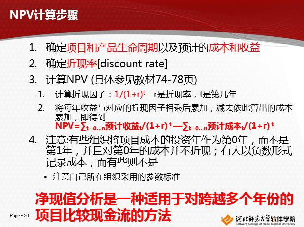

# IT项目管理

***

# 第一章 项目与项目管理概述

**1.什么是IT(信息技术)？**
> 信息技术（Information Technology，简称IT），是主要用于管理和处理信息所采用的各种技术总称。它主要是应用计算机科学和通信技术来设计、开发、安装和实施信息系统及应用软件。它也常被称为信息和通信技术

**2.什么是项目?**
> 项目(Project)是为创造独特的产品、服务或成果而进行的临时性工作

**3.项目的特点(特性)**
> 独特性、临时性、渐进明细性

注意：不满足这三个特点的不是项目

**4.什么是项目管理？**
> 项目管理(Project management)：将知识、技能、工具与技术应用于项目活动，以满足项目的要求

**5.项目干系人(了解)**
> 干系人是指参与项目或者受项目活动影响的人，包括项目发起人、项目团队、支持人员、客户、使用者、供应商、甚至是项目的反对者
> 
项目中的不同干系人的兴趣各不相同，在整个项目的过程中，干系人的期望和需求是至关重要的，成功的项目管理者会和项目的干系人建立非常好的关系，来理解和满足他们的期望和需求

**6.项目管理的典型流程**
> 启动=>规划=>执行=>监控=>收尾

**7.领导者和管理者(了解)**
> 
项目经理经常会扮演领导者和管理者的双重角色，既是领导者又是管理者  
领导者：做正确的事情  
管理者：正确地做事情

# 第二章 项目来源、论证、立项与启动

**1.项目来源**
> 
两类主要的来源：  
a.甲乙双方的项目：甲方客户提出原始需求、乙方深入分析后提出解决方案、双方签定合同、乙方启动项目实现该方案  
注意：立项采用合同的形式、合同为立项的标志

> b.研发产品类项目:  
① 产品构思：1.问题提出 2.产品愿景(定位) 3.商业机会 4.用户分析 5.技术可行性分析 6.资源分析7.风险分析 8.收益分析  
② 产品原型  
③ 管理层确认

**1-1.产品构思(商业论证)做什么？**

如何发现问题：离苦得乐，人们通常把钱花在两件事上：第一，他们经常把钱花在对抗痛苦上，第二，他们把钱花在追求享乐上

产品愿景：一句话描述产品能给予用户的深层体验  
比如：微博能够满足用户的心理诉求，让他获得安慰感、排除孤独感，让他获得成就感，让他在里面更加自信

商业机会：针对"问题"，提出改进的方案，并构建相应的商业模式（即如何赚钱)

技术可行性分析：分析是否存在技术上的难点

资源分析(估计资源需求)：人员及所需要的技能、资金、设备、设施、信息、技术

风险分析：风险是一种不确定事件或状况，如果发生将会对至少一个项目目标（如时间、成本、范围或质量）产生正面或负面的影响

收益分析(必考)：  
**a.净现值分析(NPV)**

净现值分析是投资所产生的未来现金流的折现值与项目投资成本之间的差值  

折现率:将未来有限期预期收益折算成现值的比率（观点：资本的时间价值: 今天的一元钱 > 明天的一元钱）  
 
如果财务价值作为选择项目的一个关键标准，那么组织应该只考虑那些能产生正净现值的项目,仅从财务角度看，NPV越高的方案越好

**NPV计算示例**  
  

**b.投资回报率分析(ROI)**  
投资回报率是项目收益减去成本后，再除以成本的结果  
即：ROI = (折现收益总额 – 折现成本总额)/折现成本总额  

ROI越高越好

**c.投资回收期分析**

投资回收期是以现金流的方式，将在项目中的总投资全部收回的时间

投资回收期越短越好

之后，将如上(八大点)分析汇总为统一规范文档即可

**1-2.产品原型做什么？**  

这个阶段主要是界面原型，帮助决策者了解产品如何为用户提供服务，提供哪些主要的功能  
注意：这里的界面原型只包含最核心的部分，能够说明产品特性即可

**1-3.管理层确认(产品构思的批准)**

管理层将依据产品构思和产品原型决策是否对新产品立项研发，结果通常是：   
1、批准，进入立项启动；  
2、不批准；  
3、提出需要完善的问题，延期再审批；

**2.项目启动**

如果得到客户合同或管理层的批准，就可能开始项目启动的相关工作了

**2-1.项目启动基本流程**  
1.任命项目经理  
2.组建项目核心团队  
3.制定里程碑进度计划  
4.干系人分析**(重要)**
> 干系人是积极参与项目或其利益可能受项目实施或完成的积极或消极影响的个人或组织

  
  
  
  

5.确定项目发起人  
项目发起人对项目的成功负有最终责任（通常是企业管理层人员或大BOSS），并解决项目经理无法控制的问题

6.制定项目章程  
项目章程通常由项目经理起草，由管理层确认并发布  
《项目章程》一般包括：项目背景、项目目标、项目范围 进度和交付成果、项目经理的任命  

7.召开项目启动大会

**3.项目、项目集、项目组合的概念以及三者之间的关系**  
项目：是为创造独特的产品、服务或成果而进行的临时性工作  

项目集：一组相互关联且被协调管理的项目，例如道路改造，多条路协调好先后顺序才能在保障交通的前提下改造

项目集经理：是项目经理的老板，负责监督和推进项目集工作。领导并指导项目经理完成项目集中的项目

项目组合：是指为便于有效管理、实现组织战略业务目标而组合在一起的项目、项目集和其他工作，例如“三年大变样”实现石家庄市构建良好招商环境和良好生活环境的战略目标，包含了道路改造、城中村改造、城市绿化、商业区改造等项目和项目集
  
注意：项目组合中的项目、项目集不一定彼此存在依赖或有直接关系

项目组合经理从战略视角帮助组织挑选并分析项目，以此帮助组织作出明智的投资决策

**4.三种基本的组织结构**  

* 职能型: 职能经理对CEO负责
* 项目型: 项目经理对CEO负责
* 矩阵型(最优): 介于职能型和项目型之间;  
员工通常有两个老板，这种结构通常分为弱矩阵、平衡矩阵和强矩阵

# 第三章 项目规划（重点中的重点）

每一个环节都是重点，要清楚每一个环节的工作流程

项目规划的内容：  

* 事：范围规划、事件规划、成本规划、质量规划、风险规划
* 人：人力资源规划、沟通规划、采购规划  
最后对上述规划进行整合(有时可能也算上干系人分析)

   

**1.范围规划**  

规划范围回答的是"项目做什么和得到什么结果？"的问题，这是一切后续工作的前提，由需求专家和项目经理完成  

**流程：**  
收集需求 => 定义范围 => 创建工作分解结构  
1.收集需求  
  
2.定义范围  
  
3.创建 工作分解结构(WBS)  
  
  
创建WBS由项目经理负责  
WBS包括:控制账号和工作包  
主要成果为：《WBS》、《WBS词典》  
WBS是项目规划与控制的手段。时间、成本、资源等只有在工作包一级进行规划和控制才更有意义，没有WBS，就没有项目管理。  
范围基准：定义范围成果、WBS、WBS词典

**2.时间规划**  

时间规划回答"项目做多久？何时做什么？"的问题。通常由项目经理主要负责

流程：排列工作包顺序=>估算资源=>估算持续时间=>制定进度计划

1.排列工作包顺序  
工作之间的逻辑关系有：完成到开始(FS) 完成到完成(FF) 开始到开始(SS) 开始到完成(SF)

2.资源估算  
估算每项工作(每个工作包)所需材料、人员、设备或用品的种类和数量  
在IT项目中主要的资源就是人，即分配在不同工作包上的人力资源  
常用的方法是集体讨论结合自下而上估算

3.估算持续时间  
根据资源估算的结果，估算完成单项工作所需时段数  
应由项目团队中最熟悉具体活动的成员，依据工作范围、所需资源类型、所需资源数量，开展估算  
估算持续时间的方法：自下而上结合自上而下估算、类比估算、参数估算、三点估算**(重要)**  

4.制定项目计划  
由项目经理整合前三项工作的成果，编制统一的项目进度计划  
确定项目活动计划开始日期与计划完成日期，并确定相应的里程碑  

如果已出现**资源过度分配**（如同一资源在同一时间被分配至两个甚至多个活动，或者共享或关键资源的分配超出了最大可用数量或特定可用时间），就必须进行**资源平衡**

**关键路径**是指网络中活动序列，该序列具有最长的总工期并决定了整个项目的最短完成时间；任何关键路径上活动的延迟将直接影响项目的预期完成时间；一个项目可以有多个，并行的关键路径  
如图:  

成果：《项目进度计划》 ，包括每项活动的计划开始日期与计划完成日期  
里面包含(了解)：里程碑图、甘特图、项目进度网络图  
经项目管理团队认可与批准的进度计划称为**进度基准**

**3.成本规划**  
规划成本回答"花多少钱及怎么花钱"的问题,由项目经理主要负责

流程：估算每个工作包的直接成本=>估算间接成本和储备=>管理层决策项目估算是否可行=>制定各时间段的成本开支（预算）=>管理层批准项目成本预算

1.估算每个工作包的直接成本  
依据前一阶段的成果《项目进度计划》，估算每一个工作包的直接成本  
直接成本：与创造项目成果直接相关的成本，例如项目成员的工资，项目使用的硬件设备、材料等  
常用的估算方法：自下而上估算（常用、推荐）、三点估算、类比估算、参数估算

2.估算间接成本和储备  
依据前一阶段的成果《项目进度计划》，估算工作包或更高级别分类（控制账户甚至整个项目）的间接成本和储备  
间接成本：不创造项目成果间接相关的成本，例如企业的水电费，管理费分摊  
储备:为应对未来的风险而预留的成本  
通常间接成本和储备在项目级按直接成本的一定比例估算  
成果：待审批的《项目成本估算》

3.管理层决策项目估算是否可行  
管理层审查《项目成本估算》文件（通常会深度了解估算的依据等），并决策此估算是否可行

4.制定各时间段的成本开支（预算）   
在已批准的项目估算基础上，结合进度计划安排，制定出以时间段为单位的成本开支计划，用于未来的成本控制(时间段通常以季、月、周为单位)  
成果:《成本绩效基准》

5.管理层批准项目成本预算  
管理层审查《项目成本预算》文件，并决策是否批准

总结：估算是决策的依据，预算是花钱的计划；成本主要组成包括：直接成本、间接成本、储备

**4.质量规划**  
质量规划回答"项目及项目的可交付成果做到什么程度"，由质量(测试)专家主要负责

IT项目的质量规划依据是《需求说明书》，成果为：  

* 《测试计划》：详细定义将如何实施测试过程
* 《测试用例》：详细描述对于功能性需求和非功能性需求的测试标准、方法、步骤、预期成果等

相关理论：戴明环理论(PDCA)、现代质量管理(朱兰)  

  

**5.人力资源规划**  
人力资源规划回答了"需要什么样的人，如何招募、管理、激励他们分工协作"的问题，由项目经理负责

成果为：  

* 《人力资源计划》 包括：团队的结构、角色、职责、所需技能
* 《人员配备管理计划》 包括：团队成员的进入、培养、奖惩、离开

团队的结构可为(了解)：传统组织结构、SCRUM团队结构、MSF团队结构  
  

团队成员的激励理论：马斯洛的"需求层次理论"、赫茨伯格的"激励-保健因素理论"、麦格雷戈的"X理论和Y理论"

**6.沟通规划**  
沟通规划回答的是"如何与不同的干系人交流，以达到紧密有效合作的目的"，由项目经理负责  

项目经理依据《干系人登记册》 中不同干系人的重要性、特点、与项目的关联性等，制定出不同的沟通计划，形成《沟通管理计划》（成果）  
内容包括：  
- 需要沟通的干系人。例如发起人  
- 干系人对于沟通的需求。例如项目进度  
- 沟通信息的要求。例如进度报告  
- 沟通的时限和频率。例如每周一次  
- 沟通的负责人。例如项目经理  
- 信息传递的方式。例如电子邮件  
- 沟通所需要的资源。例如占用时间2小时

**7.采购规划**  
流程(红框部分)：  

1.自制或外购分析  
确定哪些项目需求最好或必须从项目组织外部采购，而哪些可由项目团队自行完成

2.制定采购文件  
《采购文件》，记录项目采购什么、如何采购、采购多少，以及何时采购等重要信息，通常以《招标文件》的形式公布

3.发布招标  
公开招标=>邀请招标=>议标

合同类型分为：总价合同(适用于比较明确的情况)、成本补偿合同(适用于存在不确定风险时)

成果：  

* 自制或外购决策：记录了关于哪些产品、服务或成果需要从项目组织外部采购的决定，或者哪些应该由项目团队自行提供的决定。通常只包括一份清单和简要的决策理由
* 采购文件：用于征求潜在卖方的建议书。买方拟定的采购文件应便于潜在卖方做出准确、完整的应答，还要便于对卖方应答进行评价
* 合同：与选定的供应商签署正式的采购合同，依据合同来履行双方责权，确保采购顺利完成

**8.风险规划**  
规划风险回答的是"怎么解决计划赶不上变化"(提前预估项目可能遇到的风险)的问题，由项目经理负责

流程:识别风险=>实施定性风险分析=>规划风险应对策略

1.识别风险  
风险：可能对项目目标产生负面或者正面影响的不确定性  
风险可分为：消极风险、积极风险  
风险的四要素：事件、原因、发生概率、后果  
识别风险：判断哪些风险会影响项目并记录其特征  
识别风险的方法：文档审查、头脑风暴、核对表分析  

风险分解结构(RBS)(了解)：企业将以往经验所遇到的风险按类别和子类别排列为一种层级结构，用于帮助未来项目快速识别风险

2.实施定性风险分析  
使用**概率影响矩阵**对风险进行定性分析：  

3.规划风险应对策略  
消极风险的应对策略：回避、转移、减轻、接受  

积极风险应对策略：开拓、分享、提高、接受  

成果：《风险登记册》

风险不是一次整理到位，也不是固定不变的，随项目进展如上过程是反复进行的（例如周或月为单位的风险复审）

**9.整合**  
整合的意义(也可当做描述)：将各分项的规划成果整理在一起，从全局的角度指导下一阶段（执行和监控）工作

**项目经理最重要的角色是整合者**，项目经理通过沟通进行协调，通过协调进行整合

项目是被计划管着，而不是被某人管着

